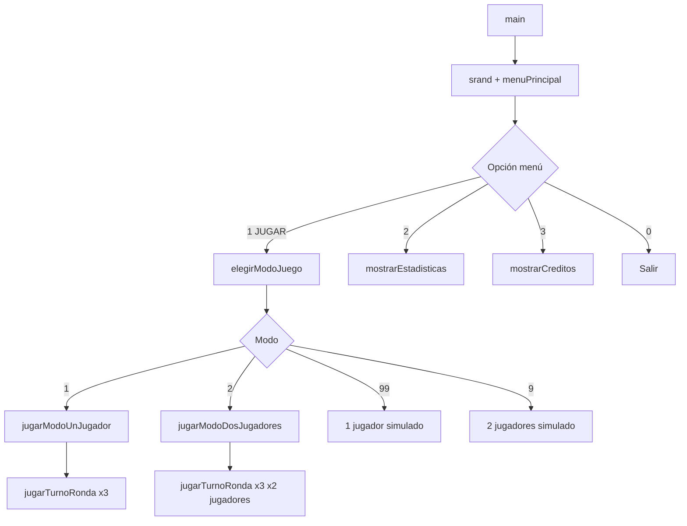

# Cazadores de Tormentas / Cazadores de Dados

**Trabajo Práctico Integrador — Programación I**  
Universidad Tecnológica Nacional — Facultad Regional General Pacheco (UTN FRGP)  
Tecnicatura Universitaria en Programación

Juego de consola desarrollado en **C++** donde uno o dos jugadores compiten durante **3 rondas** acumulando puntos. En cada ronda se lanzan **dados de viento** (bloqueadores) y **dados de tormenta**; el objetivo es sumar la mayor cantidad de puntos posible sin quedarse sin dados ni perder la ronda por destrucción total.

> En pantalla el título del menú principal muestra **"CAZADORES DE DADOS"**. El proyecto y la consigna lo denominan **"Cazadores de Tormentas"**. Es el mismo juego.

---

## Equipo — Cazadores de Códigos UTR FRGP

| Legajo | Apellido         | Nombre  |
|--------|------------------|---------|
| 34488  | Hernández Cabral | Juan    |
| 34386  | Alvez            | Joaquín |
| 34454  | Echaburu         | Iñaki   |
| 35005  | Ruiz Díaz        | Rodrigo |

---

## Cómo compilar y ejecutar

### Requisitos

- [Code::Blocks](https://www.codeblocks.org/) con compilador **GCC**
- Estándar C++: **C++11** (`-std=c++11`)

### Pasos

1. Abrir el archivo `cazadores_de_tormentas.cbp` en Code::Blocks.
2. Elegir el target **Debug** o **Release**.
3. Compilar con **Build** (F9).
4. Ejecutar con **Run** (Ctrl+F10).

El ejecutable se genera en:

- Debug: `bin/Debug/cazadores_de_tormentas.exe`
- Release: `bin/Release/cazadores_de_tormentas.exe`

### Archivos que componen el proyecto

| Archivo        | Rol                                              |
|----------------|--------------------------------------------------|
| `main.cpp`     | Punto de entrada; inicializa la semilla aleatoria |
| `menu.cpp/h`   | Menús, créditos, reglas, navegación              |
| `juego.cpp/h`  | Lógica del juego, estadísticas y modos de partida |

Los headers `.h` no se compilan por separado; declaran funciones usadas entre módulos.

---

## Menús del programa

### Menú principal

```
1. JUGAR
2. ESTADISTICAS
3. CREDITOS
0. SALIR
```

### Submenú JUGAR (modos de juego)

```
1. MODO UN JUGADOR
2. MODO DOS JUGADORES
3. REGLAS
0. VOLVER
```

### Opciones ocultas (modo simulado — para corrección/defensa)

No aparecen en pantalla. Se ingresan manualmente en el submenú de modos:

| Opción | Modo                                      |
|--------|-------------------------------------------|
| `99`   | 1 jugador con carga manual de dados       |
| `9`    | 2 jugadores con carga manual de dados     |

En modo simulado, los valores de viento y tormenta se ingresan por teclado en lugar de usar `rand()`.

---

## Reglas del juego (resumen para estudio y defensa)

### Estructura general

- Cada partida tiene **exactamente 3 rondas**.
- Modos disponibles: **1 jugador** y **2 jugadores**.
- Al inicio de **cada ronda** se lanzan **2 dados de viento** (bloqueadores). Esos valores permanecen fijos durante toda la ronda.
- Cada jugador comienza su turno en la ronda con **5 dados de tormenta** (independientes en modo 2 jugadores).

### Puntaje y bloqueo

- En cada **tirada**, se suman los valores de los dados de tormenta cuyo número **no coincide** con ninguno de los dos dados de viento.
- Si un dado de tormenta coincide con un dado de viento, ese dado se **bloquea y se elimina** del pool para el resto de la ronda (no se vuelve a tirar).

### Decisión del jugador (S/N)

Después de cada tirada, si aún quedan dados disponibles y **no** se activó tormenta perfecta:

- **S**: sigue arriesgando y tira solo los dados que le quedan.
- **N**: asegura los puntos acumulados en esa ronda, los suma al total de la partida y termina su turno.

### Reglas especiales

**Tormenta perfecta**

- Ocurre cuando en una tirada **todos los dados que se acaban de lanzar** muestran el **mismo número** y ese número **no** es un bloqueador de viento.
- El puntaje **de esa tirada** se **duplica**.
- El jugador **debe tirar de nuevo** (no se le pregunta S/N hasta completar esa tirada forzada).

**Destrucción total**

- Si en una tirada **todos** los dados restantes coinciden con los bloqueadores, el jugador se queda con **0 dados**.
- La ronda termina de inmediato y el **puntaje acumulado en esa ronda pasa a ser 0** (los puntos de rondas anteriores ya sumados al total de la partida **no** se pierden).

### Modo dos jugadores

- En cada ronda se tiran los **mismos dados de viento** para ambos jugadores.
- Cada uno juega su turno completo con su propio pool de 5 dados (el bloqueo de uno no afecta al otro).
- Al final de las 3 rondas se comparan totales: gana quien tenga más puntos; si son iguales, hay **empate**.
- Si algún jugador supera el récord de la sesión, se actualiza el record con su nombre y puntaje.

### Estadísticas (record de sesión)

- Guarda el **mejor puntaje** jugado en la sesión actual (un solo récord: nombre + puntaje).
- Si no hubo partidas que superen 0, muestra: *"No hay records registrados aun."*
- Al **cerrar el programa**, el récord se pierde (persistencia solo en memoria).

---

## Arquitectura del código

### Flujo desde `main`

```cpp
// main.cpp
int main() {
    srand(time(nullptr));  // semilla distinta en cada ejecución
    menuPrincipal();
    return 0;
}
```



### Dónde vive el estado (sin variables globales)

El récord de sesión se declara **localmente** en `menuPrincipal()` y se pasa por **referencia** a las funciones que lo necesitan:

```cpp
// menu.cpp — menuPrincipal()
char nombreRecord[50] = "";
int puntajeRecord = 0;
// ...
elegirModoJuego(nombreRecord, puntajeRecord);
```

Todo lo demás (dados, puntajes de ronda, nombres de jugadores) se maneja con variables locales dentro de cada función y parámetros. **No se usan variables globales**, cumpliendo la restricción de la cátedra.

### Constantes del juego (`juego.h`)

```cpp
const int CANTIDAD_RONDAS = 3;
const int CANTIDAD_DADOS_TORMENTA = 5;
const int CANTIDAD_DADOS_VIENTO = 2;
const int TAMANO_NOMBRE = 50;
```

---

## Módulo `juego.cpp` — funciones y responsabilidades

### Aleatoriedad

```cpp
int lanzarDado() {
    return (rand() % 6) + 1;  // devuelve un entero entre 1 y 6
}
```

### Entrada de nombres

```cpp
void pedirNombre(char nombre[], int numeroJugador);
```

- Usa `cin.getline()` para leer nombres con espacios.
- Si hay un `\n` pendiente en el buffer (por ejemplo, después de `cin >>` en el menú), lo descarta con `cin.peek()` + `cin.ignore()` **solo cuando existe**, evitando pedir Enter de más entre jugador 1 y jugador 2.

### Carga de dados

```cpp
void cargarDadosViento(int vientos[], bool modoSimulado);
void cargarDadosTormenta(int dados[], int cantidadDisponible, bool modoSimulado);
```

| `modoSimulado` | Comportamiento                                              |
|----------------|-------------------------------------------------------------|
| `false`        | Usa `lanzarDado()` / `rand()`                               |
| `true`         | Pide valores por teclado (`cin`)                            |

- `cargarDadosTormenta` solo llena las primeras `cantidadDisponible` posiciones del array (los dados ya bloqueados no se vuelven a cargar).
- En modo simulado, los dados de tormenta se validan en rango **1–6** con un `do-while`.

### Comparación y puntaje — `compararDados`

```cpp
int compararDados(int tiradaDados[], int &dadosDisponibles,
                  int viento1, int viento2,
                  int dadosValidos[], int &contadorValido);
```

**Responsabilidad:** evaluar una tirada contra los bloqueadores.

1. Recorre cada dado de la tirada actual.
2. Si coincide con `viento1` o `viento2` → se bloquea (`dadosBloqueados++`).
3. Si no coincide → suma al puntaje y guarda el valor en `dadosValidos[]`.
4. Actualiza `dadosDisponibles` restando los bloqueados (**por referencia**).
5. Devuelve la suma de la tirada (sin duplicar aún).

Fragmento clave:

```cpp
for (int i = 0; i < dadosDisponibles; i++) {
    if (tiradaDados[i] == viento1 || tiradaDados[i] == viento2) {
        dadosBloqueados++;
    } else {
        puntaje += tiradaDados[i];
        dadosValidos[contadorValido] = tiradaDados[i];
        contadorValido++;
    }
}
dadosDisponibles -= dadosBloqueados;
```

### Tormenta perfecta — `esTormentaPerfecta`

```cpp
bool esTormentaPerfecta(int tiradaDados[], int cantidadTirada,
                        int viento1, int viento2);
```

Verifica que **todos los dados de la tirada** (los `cantidadTirada` dados recién lanzados) tengan el mismo valor y que ese valor **no** sea un bloqueador.

> **Importante para la defensa:** la verificación se hace sobre la tirada completa (`tiradaDados[]`), no sobre `dadosValidos[]`. Así se evita detectar tormenta perfecta cuando solo queda un dado válido entre varios bloqueados.

### Procesamiento de una tirada — `procesarTirada`

```cpp
int procesarTirada(int dados[], int cantidadDisponible, int vientos[],
                   int &dadosRestantes, bool &tormentaPerfecta,
                   bool &destruccionTotal);
```

Orden de ejecución:

1. Llama a `compararDados` y obtiene el puntaje base.
2. Actualiza `dadosRestantes` con la cantidad de dados que siguen disponibles.
3. Si `dadosRestantes == 0` → `destruccionTotal = true`, devuelve **0**.
4. Si `esTormentaPerfecta(...)` → `tormentaPerfecta = true`, devuelve **puntaje × 2**.
5. En caso contrario, devuelve el puntaje normal.

### Turno de un jugador en una ronda — `jugarTurnoRonda`

```cpp
int jugarTurnoRonda(const char nombreJugador[], int vientos[], bool modoSimulado);
```

Devuelve el **puntaje obtenido en esa ronda** para ese jugador.

Bucle principal (`while (dadosRestantes > 0)`):

1. Carga y muestra los dados de tormenta.
2. Ejecuta `procesarTirada`.
3. Si hay destrucción total → imprime mensaje y retorna **0**.
4. Acumula puntaje de ronda e informa tirada, acumulado y dados restantes.
5. Si hubo tormenta perfecta → `continue` (tirada forzada, sin preguntar S/N).
6. Si el jugador responde **N** en `preguntarRiesgo()` → termina el turno con los puntos acumulados.

### Modos de partida

**`jugarModoUnJugador`**

- Pide nombre, juega 3 rondas, muestra puntaje final.
- Llama a `actualizarRecord` si el total supera el récord de sesión.
- Permite jugar otra partida con `preguntarOtraPartida()` (`do-while`).

**`jugarModoDosJugadores`**

- Pide dos nombres.
- Por cada ronda: mismos vientos → turno jugador 1 → turno jugador 2 → resumen de ronda.
- Al final: totales, ganador o empate, actualización de récord para ambos si corresponde.

### Estadísticas

```cpp
void actualizarRecord(char nombreRecord[], int &puntajeRecord,
                      const char nombreJugador[], int puntajeJugador);
```

Solo actualiza si `puntajeJugador > puntajeRecord` (estrictamente mayor). En empate con el récord actual, no lo reemplaza.

---

## Módulo `menu.cpp` — funciones

| Función               | Descripción                                      |
|-----------------------|--------------------------------------------------|
| `menuPrincipal()`     | Bucle del menú principal; dueño del récord       |
| `elegirModoJuego()`   | Submenú de modos; enruta a funciones de `juego` |
| `opcionesMenuPrincipal()` | Imprime opciones del menú principal        |
| `mostrarModoJuego()`  | Imprime opciones del submenú JUGAR              |
| `mostrarCreditos()`   | Muestra equipo, legajos y nombres              |
| `mostrarReglas()`     | Resumen de reglas en consola                     |

---

## Restricciones técnicas de la cátedra

| Restricción                         | Cumplimiento en este proyecto                          |
|-------------------------------------|--------------------------------------------------------|
| Proyecto de consola en C++          | Sí                                                     |
| Arrays estilo C (`int dados[5]`)    | Sí; no se usa `#include <vector>`                      |
| Sin variables globales              | Sí; estado pasado por parámetros                       |
| Código modularizado en funciones    | Sí; separación `main` / `menu` / `juego`               |
| Sin `goto`                          | Sí                                                     |
| `srand()` + `rand()`                | Sí; en `main()` y `lanzarDado()`                       |
| Modo simulado (carga manual)        | Sí; opciones ocultas `99` y `9`                        |
| Debe compilar correctamente         | Proyecto Code::Blocks con GCC y `-std=c++11`           |

---

## Ejemplo de tirada (para explicar en defensa)

**Viento:** `3` y `6`  
**Tirada:** `[1] [3] [4] [5] [3]`

- Bloqueados: los dos `3` (coinciden con viento).
- Dados restantes: `5 - 2 bloqueados = 3`.
- Puntaje de la tirada: `1 + 4 + 5 = 10`.

Si el jugador responde **N**, asegura 10 puntos en esa ronda y pasa a la siguiente ronda (o termina su turno en modo 2 jugadores).

---

## Prueba de demostración (modo simulado)

**Menú:** `1` (JUGAR) → `99` → nombre: `Test`

| Ronda | Viento | Dados de tormenta        | Acción | Resultado esperado        |
|-------|--------|--------------------------|--------|---------------------------|
| 1     | 3, 6   | 1 3 4 5 3                | N      | 10 pts en la ronda        |
| 2     | 1, 4   | 4 1 1 4 1                | —      | Destrucción total → 0 pts |
| 3     | 6, 2   | 4 4 4 4 4                | —      | Tormenta perfecta → 40 pts |
| 3     | 6, 2   | 1 2 3 4 5                | N      | +13 pts (bloquea el 2)    |

**Total final esperado:** `10 + 0 + 53 = 63`

Para 2 jugadores en simulado: usar opción **`9`** en el submenú de modos.

---

## Preguntas frecuentes en la defensa oral

**¿Por qué `dadosRestantes` se pasa por referencia?**  
Porque `procesarTirada` y `compararDados` modifican cuántos dados le quedan al jugador después de bloquear. El turno necesita ese valor actualizado para la siguiente tirada.

**¿Qué pasa si los dos dados de viento tienen el mismo valor?**  
Un dado de tormenta con ese número se bloquea igual; se compara con `viento1` **o** `viento2`.

**¿La destrucción total borra el puntaje total de la partida?**  
No. Solo anula el puntaje **de la ronda en curso**. Lo ya sumado en rondas anteriores permanece.

**¿Por qué no usamos `vector`?**  
Es una restricción explícita del TP: solo arrays de tamaño fijo estilo C.

**¿Dónde se guarda el récord?**  
En variables locales de `menuPrincipal()`, pasadas por referencia. No hay archivos ni base de datos.

**¿Por qué hay opciones 99 y 9 ocultas?**  
La consigna pide un **modo simulado** para que el corrector pueda probar casos puntuales ingresando dados manualmente, sin depender del azar.

**¿Qué pasa si hay empate en el récord?**  
`actualizarRecord` usa `>` estricto, no `>=`. Un puntaje igual al récord no lo reemplaza.

**¿Cómo se evita el bug de nombres vacíos?**  
`pedirNombre` solo hace `cin.ignore` si `cin.peek() == '\n'`, limpiando el salto de línea sobrante del menú sin bloquear la lectura del segundo jugador.

---

## Diagrama de una tirada

```
                    ┌─────────────────────┐
  cargarDadosTormenta ──► │  dadosTormenta[5]   │
                    └──────────┬──────────┘
                               │
                               ▼
                    ┌─────────────────────┐
                    │   procesarTirada    │
                    │  ├─ compararDados   │──► puntaje base
                    │  ├─ actualiza pool  │──► dadosRestantes
                    │  ├─ ¿destrucción?   │──► ronda = 0
                    │  └─ ¿tormenta perf.?│──► ×2 + tirada forzada
                    └──────────┬──────────┘
                               │
              ┌────────────────┼────────────────┐
              ▼                ▼                ▼
        Destrucción       Tormenta perf.    preguntarRiesgo
         (fin ronda)      (continue)           (S/N)
```

---

## Documentación de referencia en el repositorio

- `project-info.md` — consigna oficial del TP (reglas, pantallas, restricciones).
- `project-context.md` — contexto técnico y resumen de reglas para desarrollo.

---

## Historial de desarrollo (resumen)

El proyecto se organizó en tres capas: menú (`menu.cpp`), lógica de juego (`juego.cpp`) y entrada (`main.cpp`). La lógica de puntaje fue modularizada en `compararDados`, `esTormentaPerfecta` y `procesarTirada`, reutilizada por ambos modos de juego a través de `jugarTurnoRonda`. El modo simulado se implementó con un parámetro `bool modoSimulado` propagado desde el menú hasta las funciones de carga de dados.
